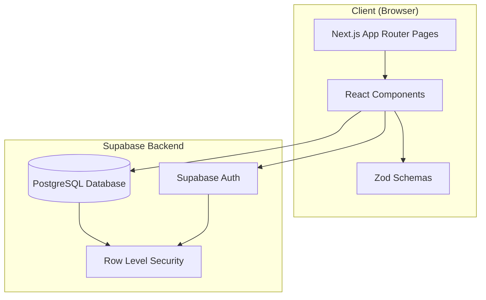

# Design Document: Todo Tracking Application

## Overview

The Todo Tracking Application is a collaborative task management system built with Next.js 14+ (App Router), TypeScript, and Supabase. The application enables users to create, organize, and share todo lists with role-based access control.

### Key Features
- User authentication with secure session management
- Personal and shared todo lists
- Role-based collaboration (owner, editor, viewer)
- Real-time data synchronization via Supabase
- Responsive desktop interface
- Type-safe data layer with generated TypeScript types

### Technology Stack
- **Frontend Framework**: Next.js 14+ with App Router
- **Language**: TypeScript (strict mode)
- **Database & Auth**: Supabase (PostgreSQL + Auth)
- **Styling**: Tailwind CSS
- **UI Components**: shadcn/ui
- **Validation**: Zod
- **Testing**: Vitest + fast-check (property-based testing)

## Architecture

### High-Level Architecture



### Application Structure

The application follows Next.js App Router conventions with route groups for organization:

```
web/
├── app/
│   ├── (auth)/              # Authentication routes (no layout)
│   │   ├── login/
│   │   │   └── page.tsx
│   │   └── register/
│   │       └── page.tsx
│   ├── (dashboard)/         # Protected routes (shared layout)
│   │   ├── dashboard/
│   │   │   └── page.tsx
│   │   └── lists/
│   │       └── [id]/
│   │           └── page.tsx
│   ├── layout.tsx           # Root layout
│   └── page.tsx             # Landing page
├── components/
│   ├── ui/                  # shadcn/ui components
│   ├── auth/                # Authentication components
│   ├── dashboard/           # Dashboard components
│   ├── lists/               # List management components
│   └── items/               # Item management components
├── lib/
│   └── supabase/
│       └── client.ts        # Supabase client configuration
├── types/
│   ├── database.ts          # Generated database types
│   ├── todo.ts              # Todo domain types
│   └── user.ts              # User domain types
└── utils/
    └── validation.ts        # Zod validation schemas
```

### Route Protection Strategy

Protected routes use Next.js middleware to check authentication status:

1. Middleware intercepts requests to protected routes
2. Checks for valid Supabase session token
3. Redirects unauthenticated users to /login
4. Allows authenticated users to proceed

## Components and Interfaces

### Core Components

#### 1. Authentication Components

**RegisterForm**
- Purpose: Handle user registration
- Props: None
- State: email, password, confirmPassword, errors, isLoading
- Methods:
  - `handleSubmit()`: Validates input and calls Supabase Auth signup
  - `validatePassword()`: Checks password requirements
- Validation: Email format, password strength (8+ chars, uppercase, lowercase, number)

**LoginForm**
- Purpose: Handle user login
- Props: None
- State: email, password, errors, isLoading
- Methods:
  - `handleSubmit()`: Validates input and calls Supabase Auth signin
- Validation: Email format, non-empty password

#### 2. Dashboard Components

**DashboardStats**
- Purpose: Display aggregate statistics
- Props: userId (string)
- State: stats (object with ownedCount, sharedCount, totalItems, completedPercentage)
- Methods:
  - `fetchStats()`: Queries database for list and item counts
  - `calculatePercentage()`: Computes completion percentage
- Data Sources: todo_list, list_membership, todo_item tables

**ListGrid**
- Purpose: Display all accessible lists in grid layout
- Props: userId (string)
- State: lists (array of list objects), isLoading
- Methods:
  - `fetchLists()`: Queries owned and shared lists
  - `handleListClick(listId)`: Navigates to list detail page
- Data Sources: todo_list, list_membership tables

**ListCard**
- Purpose: Display summary of a single list
- Props: list (object), role (string)
- Displays: title, description (truncated), item counts, role badge, last updated
- Methods:
  - `truncateDescription(text, maxLength)`: Truncates text to specified length

**CreateListModal**
- Purpose: Form for creating new lists
- Props: isOpen (boolean), onClose (function), onSuccess (function)
- State: title, description, errors, isLoading
- Methods:
  - `handleSubmit()`: Validates and creates list
  - `resetForm()`: Clears form state
- Validation: Title required (max 100 chars), description optional (max 500 chars)

#### 3. List Detail Components

**ListHeader**
- Purpose: Display list title, description, and actions
- Props: list (object), isOwner (boolean)
- Displays: title, description, "Add Item" button, "Share List" button (if owner)
- Methods:
  - `handleAddItem()`: Opens add item modal
  - `handleShare()`: Opens share modal

**ItemList**
- Purpose: Display all items in a list
- Props: listId (string), userRole (string)
- State: items (array), isLoading
- Methods:
  - `fetchItems()`: Queries items for the list
  - `handleItemClick(itemId)`: Opens edit modal
- Data Sources: todo_item table

**ItemCard**
- Purpose: Display a single todo item
- Props: item (object), onClick (function)
- Displays: checkbox, title, truncated description
- Methods:
  - `handleCheckboxClick(e)`: Prevents event propagation, toggles status

**AddItemModal**
- Purpose: Form for creating new items
- Props: listId (string), isOpen (boolean), onClose (function), onSuccess (function)
- State: title, description, errors, isLoading
- Methods:
  - `handleSubmit()`: Validates and creates item
- Validation: Title required (max 200 chars), description optional (max 1000 chars)

**EditItemModal**
- Purpose: Form for editing existing items
- Props: item (object), isOpen (boolean), onClose (function), onSuccess (function)
- State: title, description, errors, isLoading, showDeleteConfirm
- Methods:
  - `handleSubmit()`: Validates and updates item
  - `handleToggleStatus()`: Updates completion status
  - `handleDelete()`: Shows confirmation then deletes item
- Validation: Same as AddItemModal

#### 4. Sharing Components

**ShareListModal**
- Purpose: Form for inviting users to a list
- Props: listId (string), isOpen (boolean), onClose (function), onSuccess (function)
- State: email, role, errors, isLoading
- Methods:
  - `handleSubmit()`: Validates and creates invitation
- Validation: Valid email format, role selection (viewer/editor)

**InvitationList**
- Purpose: Display pending invitations
- Props: userId (string)
- State: invitations (array), isLoading
- Methods:
  - `fetchInvitations()`: Queries pending invitations for user's email
  - `handleAccept(invitationId)`: Accepts invitation and creates membership
  - `handleDecline(invitationId)`: Declines invitation
- Data Sources: invitation table

**InvitationCard**
- Purpose: Display a single invitation
- Props: invitation (object), onAccept (function), onDecline (function)
- Displays: list title, inviter email, role, accept/decline buttons

### Data Access Layer

#### Supabase Client Configuration

```typescript
// lib/supabase/client.ts
import { createClient } from '@supabase/supabase-js'
import type { Database } from '@/types/database'

const supabaseUrl = process.env.NEXT_PUBLIC_SUPABASE_URL!
const supabaseAnonKey = process.env.NEXT_PUBLIC_SUPABASE_ANON_KEY!

export const supabase = createClient<Database>(supabaseUrl, supabaseAnonKey, {
  auth: {
    persistSession: true,
    autoRefreshToken: true,
  },
})
```

#### Data Access Functions

**Authentication**
```typescript
// Register user
async function registerUser(email: string, password: string): Promise<Result<User>>

// Login user
async function loginUser(email: string, password: string): Promise<Result<Session>>

// Get current session
async function getSession(): Promise<Session | null>

// Logout user
async function logoutUser(): Promise<void>
```

**Lists**
```typescript
// Create list
async function createList(title: string, description?: string): Promise<Result<TodoList>>

// Get lists for user (owned + shared)
async function getListsForUser(userId: string): Promise<Result<TodoList[]>>

// Get list by ID
async function getListById(listId: string): Promise<Result<TodoList>>

// Update list
async function updateList(listId: string, updates: Partial<TodoList>): Promise<Result<TodoList>>

// Delete list
async function deleteList(listId: string): Promise<Result<void>>
```

**Items**
```typescript
// Create item
async function createItem(listId: string, title: string, description?: string): Promise<Result<TodoItem>>

// Get items for list
async function getItemsForList(listId: string): Promise<Result<TodoItem[]>>

// Update item
async function updateItem(itemId: string, updates: Partial<TodoItem>): Promise<Result<TodoItem>>

// Toggle item status
async function toggleItemStatus(itemId: string): Promise<Result<TodoItem>>

// Delete item
async function deleteItem(itemId: string): Promise<Result<void>>
```

**Invitations**
```typescript
// Create invitation
async function createInvitation(listId: string, email: string, role: ListRole): Promise<Result<Invitation>>

// Get pending invitations for email
async function getPendingInvitations(email: string): Promise<Result<Invitation[]>>

// Accept invitation
async function acceptInvitation(invitationId: string): Promise<Result<ListMembership>>

// Decline invitation
async function declineInvitation(invitationId: string): Promise<Result<void>>
```

**Statistics**
```typescript
// Get dashboard statistics
async function getDashboardStats(userId: string): Promise<Result<DashboardStats>>

interface DashboardStats {
  ownedListsCount: number
  sharedListsCount: number
  totalItems: number
  completedItems: number
  completionPercentage: number
}
```

### Result Type Pattern

All data access functions return a `Result<T>` type for consistent error handling:

```typescript
type Result<T> = 
  | { success: true; data: T }
  | { success: false; error: string }
```

This pattern allows components to handle errors uniformly:

```typescript
const result = await createList(title, description)
if (!result.success) {
  setError(result.error)
  return
}
// Use result.data
```

## Data Models

### Database Schema

The application uses the following Supabase tables:

#### app_user
```sql
CREATE TABLE app_user (
  id UUID PRIMARY KEY DEFAULT uuid_generate_v4(),
  email TEXT UNIQUE NOT NULL,
  created_at TIMESTAMPTZ DEFAULT NOW()
);
```

#### todo_list
```sql
CREATE TABLE todo_list (
  id UUID PRIMARY KEY DEFAULT uuid_generate_v4(),
  title TEXT NOT NULL CHECK (length(title) <= 100),
  description TEXT CHECK (length(description) <= 500),
  owner_user_id UUID NOT NULL REFERENCES app_user(id) ON DELETE CASCADE,
  created_at TIMESTAMPTZ DEFAULT NOW(),
  updated_at TIMESTAMPTZ DEFAULT NOW()
);
```

#### todo_item
```sql
CREATE TYPE todo_item_status AS ENUM ('pending', 'completed');

CREATE TABLE todo_item (
  id UUID PRIMARY KEY DEFAULT uuid_generate_v4(),
  list_id UUID NOT NULL REFERENCES todo_list(id) ON DELETE CASCADE,
  title TEXT NOT NULL CHECK (length(title) <= 200),
  description TEXT CHECK (length(description) <= 1000),
  status todo_item_status DEFAULT 'pending',
  created_by_user_id UUID NOT NULL REFERENCES app_user(id),
  updated_by_user_id UUID NOT NULL REFERENCES app_user(id),
  completed_at TIMESTAMPTZ,
  created_at TIMESTAMPTZ DEFAULT NOW(),
  updated_at TIMESTAMPTZ DEFAULT NOW()
);
```

#### list_membership
```sql
CREATE TYPE list_role AS ENUM ('owner', 'editor', 'viewer');

CREATE TABLE list_membership (
  id UUID PRIMARY KEY DEFAULT uuid_generate_v4(),
  list_id UUID NOT NULL REFERENCES todo_list(id) ON DELETE CASCADE,
  user_id UUID NOT NULL REFERENCES app_user(id) ON DELETE CASCADE,
  role list_role NOT NULL,
  created_at TIMESTAMPTZ DEFAULT NOW(),
  UNIQUE(list_id, user_id)
);
```

#### invitation
```sql
CREATE TYPE invitation_status AS ENUM ('pending', 'accepted', 'declined');

CREATE TABLE invitation (
  id UUID PRIMARY KEY DEFAULT uuid_generate_v4(),
  list_id UUID NOT NULL REFERENCES todo_list(id) ON DELETE CASCADE,
  invited_email TEXT NOT NULL,
  invited_by_user_id UUID NOT NULL REFERENCES app_user(id),
  role list_role NOT NULL,
  status invitation_status DEFAULT 'pending',
  accepted_at TIMESTAMPTZ,
  created_at TIMESTAMPTZ DEFAULT NOW()
);
```

### TypeScript Types

#### Generated Database Types

```typescript
// types/database.ts
export type Database = {
  public: {
    Tables: {
      app_user: {
        Row: {
          id: string
          email: string
          created_at: string
        }
        Insert: {
          id?: string
          email: string
          created_at?: string
        }
        Update: {
          id?: string
          email?: string
          created_at?: string
        }
      }
      todo_list: {
        Row: {
          id: string
          title: string
          description: string | null
          owner_user_id: string
          created_at: string
          updated_at: string
        }
        Insert: {
          id?: string
          title: string
          description?: string | null
          owner_user_id: string
          created_at?: string
          updated_at?: string
        }
        Update: {
          id?: string
          title?: string
          description?: string | null
          owner_user_id?: string
          created_at?: string
          updated_at?: string
        }
      }
      todo_item: {
        Row: {
          id: string
          list_id: string
          title: string
          description: string | null
          status: 'pending' | 'completed'
          created_by_user_id: string
          updated_by_user_id: string
          completed_at: string | null
          created_at: string
          updated_at: string
        }
        Insert: {
          id?: string
          list_id: string
          title: string
          description?: string | null
          status?: 'pending' | 'completed'
          created_by_user_id: string
          updated_by_user_id: string
          completed_at?: string | null
          created_at?: string
          updated_at?: string
        }
        Update: {
          id?: string
          list_id?: string
          title?: string
          description?: string | null
          status?: 'pending' | 'completed'
          created_by_user_id?: string
          updated_by_user_id?: string
          completed_at?: string | null
          created_at?: string
          updated_at?: string
        }
      }
      list_membership: {
        Row: {
          id: string
          list_id: string
          user_id: string
          role: 'owner' | 'editor' | 'viewer'
          created_at: string
        }
        Insert: {
          id?: string
          list_id: string
          user_id: string
          role: 'owner' | 'editor' | 'viewer'
          created_at?: string
        }
        Update: {
          id?: string
          list_id?: string
          user_id?: string
          role?: 'owner' | 'editor' | 'viewer'
          created_at?: string
        }
      }
      invitation: {
        Row: {
          id: string
          list_id: string
          invited_email: string
          invited_by_user_id: string
          role: 'editor' | 'viewer'
          status: 'pending' | 'accepted' | 'declined'
          accepted_at: string | null
          created_at: string
        }
        Insert: {
          id?: string
          list_id: string
          invited_email: string
          invited_by_user_id: string
          role: 'editor' | 'viewer'
          status?: 'pending' | 'accepted' | 'declined'
          accepted_at?: string | null
          created_at?: string
        }
        Update: {
          id?: string
          list_id?: string
          invited_email?: string
          invited_by_user_id?: string
          role?: 'editor' | 'viewer'
          status?: 'pending' | 'accepted' | 'declined'
          accepted_at?: string | null
          created_at?: string
        }
      }
    }
    Enums: {
      list_role: 'owner' | 'editor' | 'viewer'
      invitation_status: 'pending' | 'accepted' | 'declined'
      todo_item_status: 'pending' | 'completed'
    }
  }
}
```

#### Domain Types

```typescript
// types/todo.ts
export interface TodoList {
  id: string
  title: string
  description: string | null
  ownerUserId: string
  createdAt: string
  updatedAt: string
}

export interface TodoItem {
  id: string
  listId: string
  title: string
  description: string | null
  status: 'pending' | 'completed'
  createdByUserId: string
  updatedByUserId: string
  completedAt: string | null
  createdAt: string
  updatedAt: string
}

export interface ListMembership {
  id: string
  listId: string
  userId: string
  role: 'owner' | 'editor' | 'viewer'
  createdAt: string
}

export interface Invitation {
  id: string
  listId: string
  invitedEmail: string
  invitedByUserId: string
  role: 'editor' | 'viewer'
  status: 'pending' | 'accepted' | 'declined'
  acceptedAt: string | null
  createdAt: string
}

// types/user.ts
export interface User {
  id: string
  email: string
  createdAt: string
}
```

### Validation Schemas

```typescript
// utils/validation.ts
import { z } from 'zod'

export const registerSchema = z.object({
  email: z.string().email('Invalid email format'),
  password: z
    .string()
    .min(8, 'Password must be at least 8 characters')
    .regex(/[A-Z]/, 'Password must contain at least one uppercase letter')
    .regex(/[a-z]/, 'Password must contain at least one lowercase letter')
    .regex(/[0-9]/, 'Password must contain at least one number'),
  confirmPassword: z.string(),
}).refine((data) => data.password === data.confirmPassword, {
  message: "Passwords don't match",
  path: ['confirmPassword'],
})

export const loginSchema = z.object({
  email: z.string().email('Invalid email format'),
  password: z.string().min(1, 'Password is required'),
})

export const createListSchema = z.object({
  title: z.string().min(1, 'Title is required').max(100, 'Title must be 100 characters or less'),
  description: z.string().max(500, 'Description must be 500 characters or less').optional(),
})

export const createItemSchema = z.object({
  title: z.string().min(1, 'Title is required').max(200, 'Title must be 200 characters or less'),
  description: z.string().max(1000, 'Description must be 1000 characters or less').optional(),
  listId: z.string().uuid('Invalid list ID'),
})

export const updateItemSchema = z.object({
  title: z.string().min(1, 'Title is required').max(200, 'Title must be 200 characters or less').optional(),
  description: z.string().max(1000, 'Description must be 1000 characters or less').optional(),
  status: z.enum(['pending', 'completed']).optional(),
})

export const createInvitationSchema = z.object({
  invitedEmail: z.string().email('Invalid email format'),
  role: z.enum(['viewer', 'editor'], { errorMap: () => ({ message: 'Role must be viewer or editor' }) }),
  listId: z.string().uuid('Invalid list ID'),
})
```

### Row Level Security Policies

The database enforces access control through RLS policies:

**app_user policies:**
- Users can read their own record
- Users can update their own record

**todo_list policies:**
- Users can read lists they own
- Users can read lists they are members of (via list_membership)
- Users can create lists (owner_user_id set to authenticated user)
- Users can update lists they own
- Users can delete lists they own

**todo_item policies:**
- Users can read items in lists they have access to
- Users with owner or editor role can create items
- Users with owner or editor role can update items
- Users with owner or editor role can delete items

**list_membership policies:**
- Users can read memberships for lists they own or are members of
- System creates memberships when invitations are accepted

**invitation policies:**
- Users can read invitations they sent
- Users can read invitations sent to their email
- List owners can create invitations
- Users can update invitations sent to their email (accept/decline)


## Correctness Properties

*A property is a characteristic or behavior that should hold true across all valid executions of a system—essentially, a formal statement about what the system should do. Properties serve as the bridge between human-readable specifications and machine-verifiable correctness guarantees.*

### Property Reflection

After analyzing all acceptance criteria, I identified the following testable properties. During reflection, I combined related properties to eliminate redundancy:

- **Dashboard statistics** can be tested as a single comprehensive property rather than separate properties for each stat
- **List card display** can be tested as one property covering all required fields
- **Item display** can be tested as one property covering all required fields
- **Authorization checks** can be grouped by resource type (lists vs items)
- **Invitation workflow** (accept/decline) can be tested as separate properties since they have different outcomes

### Properties

**Property 1: User Registration Success**

*For any* valid email and password (meeting all requirements: 8+ characters, uppercase, lowercase, number), registering a new user should create a user account and allow subsequent login with those credentials.

**Validates: Requirements 1.6**

---

**Property 2: User Authentication Session Persistence**

*For any* authenticated user, the session should remain valid across multiple requests without requiring re-authentication.

**Validates: Requirements 2.4**

---

**Property 3: Protected Route Access Control**

*For any* protected route, an authenticated user should be able to access it, while an unauthenticated user should be redirected to /login.

**Validates: Requirements 3.3**

---

**Property 4: Dashboard Statistics Accuracy**

*For any* user with accessible lists and items, the dashboard should correctly calculate and display:
- Total owned lists count
- Total shared lists count  
- Total items count across all accessible lists
- Completion percentage as (completed_items / total_items) * 100
- "No items yet" when total_items is 0

**Validates: Requirements 4.2, 4.3, 4.4, 4.5, 4.6**

---

**Property 5: List Card Display Completeness**

*For any* todo list, the list card should display all required information: title, description (truncated to 100 chars), item count (completed/total), role badge (Owner or Shared with role), and last updated timestamp.

**Validates: Requirements 5.1, 5.2, 5.3, 5.4, 5.5, 5.6**

---

**Property 6: List Creation and Persistence**

*For any* valid list data (title 1-100 chars, optional description up to 500 chars), creating a list should persist it to the database with the current user as owner, set timestamps, and make it accessible in subsequent queries.

**Validates: Requirements 6.8, 6.9, 6.10**

---

**Property 7: List Detail View Completeness**

*For any* accessible list, the detail view should display the title, description, all items in the list, an "Add Item" button, and a "Share List" button if and only if the user is the owner.

**Validates: Requirements 7.1, 7.2, 7.3, 7.4, 7.5, 7.6**

---

**Property 8: List Access Authorization**

*For any* list and user combination, the user should be able to access the list if and only if they are the owner or a member (via list_membership), otherwise receiving a 403 error.

**Validates: Requirements 8.1, 8.2, 8.3**

---

**Property 9: Item Creation and Persistence**

*For any* valid item data (title 1-200 chars, optional description up to 1000 chars) and accessible list, creating an item should persist it with status 'pending', set creator and updater to current user, set timestamps, and make it appear in the list's items.

**Validates: Requirements 9.7, 9.8, 9.9, 9.10**

---

**Property 10: Item Display Completeness**

*For any* todo item, the display should show a checkbox reflecting completion status (checked for 'completed', unchecked for 'pending'), the title, and the description truncated to 50 characters.

**Validates: Requirements 10.1, 10.2, 10.3, 10.4, 10.5**

---

**Property 11: Item Update Persistence**

*For any* item and valid updates (title, description, or status), updating the item should persist the changes, set updated_by_user_id to current user, and update the updated_at timestamp.

**Validates: Requirements 11.8, 11.9**

---

**Property 12: Item Status Toggle Correctness**

*For any* item, toggling from 'pending' to 'completed' should set status to 'completed' and set completed_at to current timestamp, while toggling from 'completed' to 'pending' should set status to 'pending' and set completed_at to NULL.

**Validates: Requirements 12.1, 12.2, 12.3, 12.4, 12.5, 12.6**

---

**Property 13: Item Deletion**

*For any* item that a user has permission to delete, deleting it should remove it from the database and it should no longer appear in subsequent queries for that list's items.

**Validates: Requirements 13.2, 13.3**

---

**Property 14: Item Authorization by Role**

*For any* item operation (create, update, delete) and user with a specific role:
- Users with 'owner' or 'editor' role should be able to perform the operation
- Users with 'viewer' role should receive a 403 error
- Users with no access to the list should receive a 403 error

**Validates: Requirements 14.1, 14.2, 14.3, 14.4, 14.5, 14.6, 14.7, 14.8, 14.9**

---

**Property 15: Invitation Creation and Persistence**

*For any* valid invitation data (valid email, role of 'viewer' or 'editor') and list owned by the current user, creating an invitation should persist it with status 'pending', set invited_by_user_id to current user, and make it queryable by the invited email.

**Validates: Requirements 15.7, 15.8, 15.9**

---

**Property 16: Pending Invitations Visibility**

*For any* user email, querying pending invitations should return all and only invitations with status 'pending' that match that email address.

**Validates: Requirements 16.1, 16.2**

---

**Property 17: Invitation Acceptance Creates Membership**

*For any* pending invitation, accepting it should:
- Update invitation status to 'accepted'
- Set accepted_at timestamp
- Create a list_membership record with the specified role
- Make the list accessible to the user
- Remove the invitation from pending queries

**Validates: Requirements 17.1, 17.2, 17.3, 17.4, 17.5**

---

**Property 18: Invitation Decline**

*For any* pending invitation, declining it should update the status to 'declined', remove it from pending queries, and NOT create a list_membership record.

**Validates: Requirements 18.1, 18.2, 18.3**

---

**Property 19: Form Validation Consistency**

*For any* form with Zod schema validation, submitting invalid data should prevent submission, display field-level errors inline, and allow submission only after all errors are resolved.

**Validates: Requirements 26.1, 26.2, 26.3, 26.4**

---

## Error Handling

### Error Categories

The application handles four categories of errors:

1. **Validation Errors**: Client-side validation failures (Zod schema violations)
2. **Authentication Errors**: Login/registration failures
3. **Authorization Errors**: Permission denied (403)
4. **Server Errors**: Database or network failures

### Error Handling Strategy

**Validation Errors**
- Caught at form submission
- Displayed inline below form fields
- Prevent form submission until resolved
- Example: "Title must be 100 characters or less"

**Authentication Errors**
- Caught from Supabase Auth responses
- Displayed as toast notifications
- Clear password field on error
- Maintain email field value
- Example: "Invalid credentials", "Email already exists"

**Authorization Errors**
- Caught from RLS policy violations (403 responses)
- Displayed as toast notifications
- Redirect to dashboard
- Example: "You don't have permission to perform this action"

**Server Errors**
- Caught from Supabase client errors
- Displayed as toast notifications
- Log to console for debugging
- Example: "Failed to load lists. Please try again."

### Error Display Components

```typescript
// Toast notification for global errors
function showError(message: string): void {
  toast({
    title: "Error",
    description: message,
    variant: "destructive",
  })
}

// Inline field error display
function FieldError({ message }: { message?: string }): JSX.Element {
  if (!message) return null
  return <p className="text-sm text-red-500 mt-1">{message}</p>
}
```

### Result Type Error Handling

All data access functions use the Result type pattern:

```typescript
// Success case
const result = await createList(title, description)
if (result.success) {
  // Use result.data
  router.push(`/lists/${result.data.id}`)
} else {
  // Handle result.error
  showError(result.error)
}
```

This pattern ensures:
- Explicit error handling at call sites
- Type-safe error messages
- Consistent error handling across the application
- No uncaught promise rejections

### Input Sanitization

All user inputs are sanitized before processing:

1. **Whitespace trimming**: Applied to all text inputs
2. **Length validation**: Enforced by Zod schemas
3. **Format validation**: Email, UUID formats validated
4. **SQL injection prevention**: Parameterized queries via Supabase client

```typescript
// Example sanitization in form handler
const sanitizedData = {
  title: formData.title.trim(),
  description: formData.description?.trim(),
}

const result = createListSchema.safeParse(sanitizedData)
if (!result.success) {
  // Handle validation errors
}
```

## Testing Strategy

### Dual Testing Approach

The application uses both unit tests and property-based tests for comprehensive coverage:

**Unit Tests**
- Specific examples demonstrating correct behavior
- Edge cases (empty inputs, max length, special characters)
- Error conditions (invalid credentials, unauthorized access)
- Integration points between components
- UI component rendering

**Property-Based Tests**
- Universal properties that hold for all inputs
- Comprehensive input coverage through randomization
- Minimum 100 iterations per test
- Each test references its design document property

### Property-Based Testing with fast-check

The application uses [fast-check](https://github.com/dubzzz/fast-check) for property-based testing in TypeScript.

**Configuration**
```typescript
// vitest.config.ts
export default defineConfig({
  test: {
    globals: true,
    environment: 'jsdom',
  },
})
```

**Test Structure**
```typescript
import { fc, test } from '@fast-check/vitest'

test.prop([fc.string(), fc.string()])('property description', (input1, input2) => {
  // Feature: todo-tracking-app, Property N: [property text]
  
  // Test implementation
  expect(result).toBe(expected)
}, { numRuns: 100 })
```

**Custom Generators**

The test suite includes custom generators for domain objects:

```typescript
// Generators for domain objects
const emailArbitrary = fc.emailAddress()

const passwordArbitrary = fc.string({ minLength: 8, maxLength: 50 })
  .filter(pwd => /[A-Z]/.test(pwd) && /[a-z]/.test(pwd) && /[0-9]/.test(pwd))

const listTitleArbitrary = fc.string({ minLength: 1, maxLength: 100 })

const listDescriptionArbitrary = fc.option(
  fc.string({ maxLength: 500 }),
  { nil: null }
)

const itemTitleArbitrary = fc.string({ minLength: 1, maxLength: 200 })

const itemDescriptionArbitrary = fc.option(
  fc.string({ maxLength: 1000 }),
  { nil: null }
)

const roleArbitrary = fc.constantFrom('owner', 'editor', 'viewer')

const itemStatusArbitrary = fc.constantFrom('pending', 'completed')
```

### Test Organization

```
web/
├── __tests__/
│   ├── unit/
│   │   ├── components/
│   │   │   ├── auth/
│   │   │   ├── dashboard/
│   │   │   ├── lists/
│   │   │   └── items/
│   │   ├── lib/
│   │   │   └── supabase/
│   │   └── utils/
│   │       └── validation.test.ts
│   └── properties/
│       ├── auth.properties.test.ts
│       ├── lists.properties.test.ts
│       ├── items.properties.test.ts
│       ├── invitations.properties.test.ts
│       └── authorization.properties.test.ts
```

### Property Test Examples

**Property 1: User Registration Success**
```typescript
test.prop([emailArbitrary, passwordArbitrary])(
  'valid registration creates account',
  async (email, password) => {
    // Feature: todo-tracking-app, Property 1: User Registration Success
    
    const result = await registerUser(email, password)
    expect(result.success).toBe(true)
    
    // Should be able to login with same credentials
    const loginResult = await loginUser(email, password)
    expect(loginResult.success).toBe(true)
  },
  { numRuns: 100 }
)
```

**Property 6: List Creation and Persistence**
```typescript
test.prop([listTitleArbitrary, listDescriptionArbitrary])(
  'created lists are persisted and accessible',
  async (title, description) => {
    // Feature: todo-tracking-app, Property 6: List Creation and Persistence
    
    const createResult = await createList(title, description)
    expect(createResult.success).toBe(true)
    
    const listId = createResult.data.id
    const fetchResult = await getListById(listId)
    expect(fetchResult.success).toBe(true)
    expect(fetchResult.data.title).toBe(title)
    expect(fetchResult.data.description).toBe(description)
  },
  { numRuns: 100 }
)
```

**Property 12: Item Status Toggle Correctness**
```typescript
test.prop([itemTitleArbitrary, itemDescriptionArbitrary])(
  'toggling item status updates correctly',
  async (title, description) => {
    // Feature: todo-tracking-app, Property 12: Item Status Toggle Correctness
    
    // Create item (starts as pending)
    const item = await createItem(testListId, title, description)
    expect(item.data.status).toBe('pending')
    expect(item.data.completedAt).toBeNull()
    
    // Toggle to completed
    const completed = await toggleItemStatus(item.data.id)
    expect(completed.data.status).toBe('completed')
    expect(completed.data.completedAt).not.toBeNull()
    
    // Toggle back to pending
    const pending = await toggleItemStatus(item.data.id)
    expect(pending.data.status).toBe('pending')
    expect(pending.data.completedAt).toBeNull()
  },
  { numRuns: 100 }
)
```

### Unit Test Examples

**Edge Case: Empty Title Validation**
```typescript
describe('List Creation Validation', () => {
  it('rejects empty title', async () => {
    const result = createListSchema.safeParse({ title: '', description: 'test' })
    expect(result.success).toBe(false)
    if (!result.success) {
      expect(result.error.issues[0].message).toContain('Title is required')
    }
  })
  
  it('rejects title exceeding 100 characters', async () => {
    const longTitle = 'a'.repeat(101)
    const result = createListSchema.safeParse({ title: longTitle })
    expect(result.success).toBe(false)
  })
})
```

**Integration: Route Protection**
```typescript
describe('Protected Routes', () => {
  it('redirects unauthenticated user from /dashboard to /login', async () => {
    // Clear session
    await supabase.auth.signOut()
    
    // Attempt to access dashboard
    const response = await fetch('/dashboard')
    expect(response.redirected).toBe(true)
    expect(response.url).toContain('/login')
  })
})
```

### Test Coverage Goals

- **Unit Tests**: 80%+ code coverage
- **Property Tests**: All 19 correctness properties implemented
- **Integration Tests**: Critical user flows (register → login → create list → add item)
- **Edge Cases**: All validation boundaries and error conditions

### Continuous Integration

Tests run automatically on:
- Every commit (pre-commit hook)
- Pull requests (GitHub Actions)
- Before deployment

```yaml
# .github/workflows/test.yml
name: Test
on: [push, pull_request]
jobs:
  test:
    runs-on: ubuntu-latest
    steps:
      - uses: actions/checkout@v3
      - uses: actions/setup-node@v3
      - run: npm ci
      - run: npm run test
      - run: npm run test:properties
```
